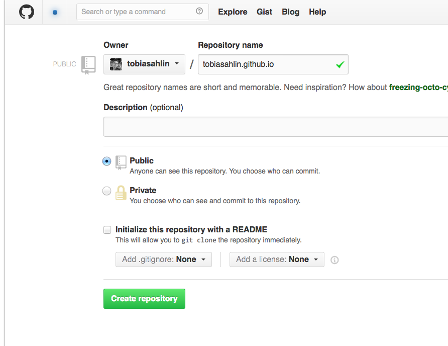
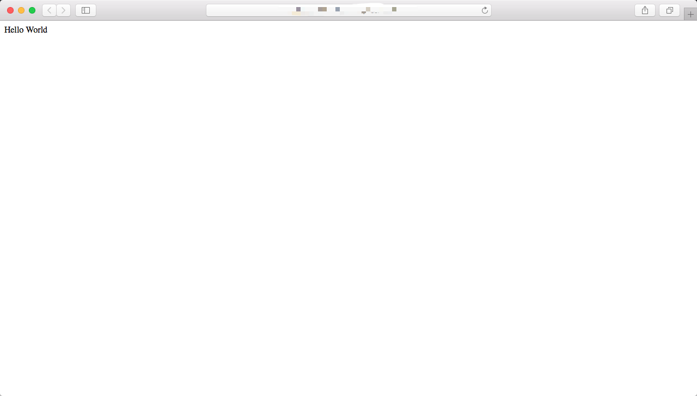

作为第一篇分享的技术类文章，打算从如何搭建这个个人博客说起。想必每一名程序员都想拥有自己的博客，大致上无外乎以下三种：

1. 在某个技术论坛扎根
2. 自己买空间
3. 在GitHub Pages上搭建自己的个人主页

从我个人的考虑还是倾向于第三种，第一种不太适合我是因为目前支持markdown的论坛比较少，还没找到合适的。
第二种需要自己买空间，花钱倒不是主要问题，问题是维护成本有点高，而且买了空间，只用搭建自己的博客感觉有点浪费……
所以最后决定是用GitHub Pages+Jekyll+Markdown来搭建自己的个人博客。

因此，打算分别用三个篇章来介绍如何搭建自己的个人博客。
1. 「[搭建属于自己的博客——GitHub Pages篇]({{ site.url }}/documentation/build-blog-pages.html)」
2. 「[搭建属于自己的博客——Jekyll篇]({{ site.url }}/documentation/build-blog-jekyll.html)」
3. 「[搭建属于自己的博客——Markdown篇]({{ site.url }}/documentation/build-blog-markdown.html)」

## 什么是GitHub Pages?

「[GitHub Pages](https://pages.github.com/)」是一个静态站点托管服务。

GitHub Pages的设计目的是直接从GitHub库中托管我们的个人、组织或项目页面。
我们可以使用Jekyll主题选择器在网上创建和发布GitHub页面。如果喜欢在本地工作，可以使用GitHub桌面或命令行。

其实最重要的是GitHub Pages支持了我们可以直接在自己的GitHub上的repository上创建一个project，这个project就是我们的个人主页的项目。
只要我们去把记得写的博文push到这个project，就可以直接发布到对应的自己的个人主页或者项目主页上。这是一个非常方便的操作。比方说我们有一些自己写过的project
必然要有一个汇总的介绍，除了每个project中要有自己的页面做介绍外，还应该有一个个人主页。那么我只需要建立一个以我的GitHub的username.github.io的repository
那么这个代码仓库中的pages就会自动发布到我们的个人主页上。

## 快速创建一个属于自己的站点

1. 首先要有一个自己的GitHub账号。作为一个程序员，大家应该都有自己的GitHub账号吧。如果还没有快去注册一个吧。「[GitHub](https://github.com/)」

2. 接下来我们在自己的账号下要创建一个repository。这个repository名称是有要求的，需要以*username*.github.io来命名，其中username是我们的GitHub账号名称。

3. 创建完成后，GitHub会生成我们刚刚创建的repository的连接。接下来需要复制这个连接，大概terminal，将项目clone下来。

   > git clone https://github.com/*username*/*username*.github.io

4. 继续进入到local的项目中，创建一个带有”Hello World“内容的index.html

   > cd *username*.github.io
   >
   > echo "Hello World" > index.html

5. 最后将我们的个人首页push到remote的repository中。

   > git add --all
   >
   > git commit -m "Initial commit"
   >
   > git push -u origin master

6. 搞定！接下来在浏览器就可以直接访问我们的个人主页啦！**https://username.github.io**.

本编我们花了10分钟就快速搭建完了自己的个人主页，不过我们可以看到，还是一个很简单的首页。离我们想要的属于自己的博客还有一段距离，不过没关系，接下来的「[搭建属于自己的博客——Jekyll篇]({{ site.url }}/documentation/build-blog-jekyll.html)」
中我们将会花10分钟快速生成我们的博客，敬请期待吧！

