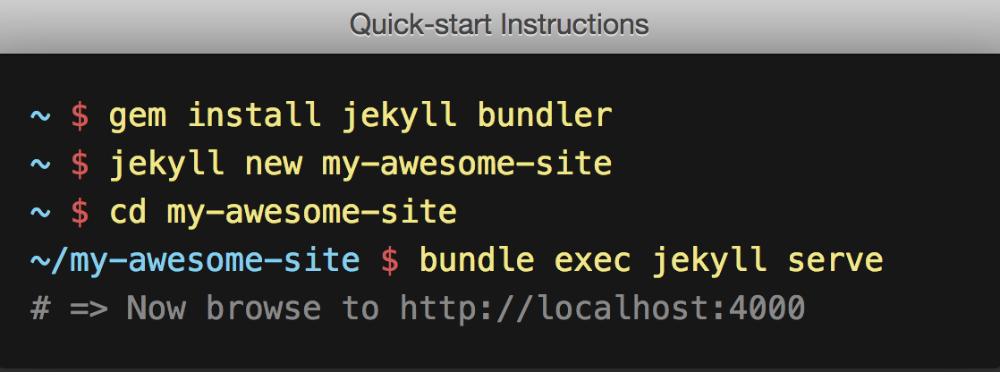
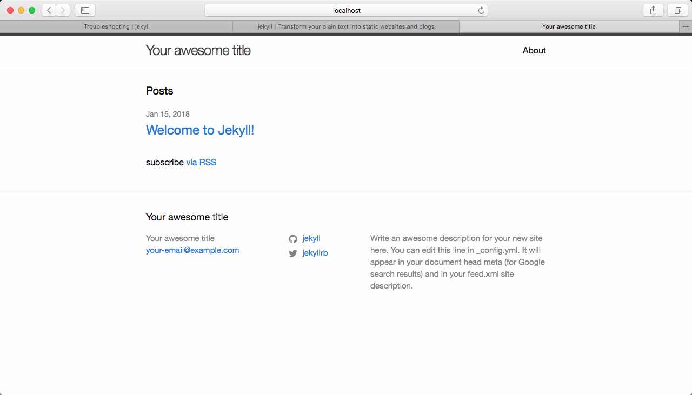

我们在上一篇「[搭建属于自己的博客——GitHub Pages篇]({{ site.url }}/documentation/build-blog-pages.html)」中
已经在GitHub Pages上创建了属于自己主页，当然了内容非常简单，只有一个简单的"Hello World"。
接下来我们打算用10分钟的时间将这个简单的"Hello World"页面快速的搭建好一套可以用来发布博文的博客空间。

首先我们先review一遍我们要做的三件事：

1. 「[搭建属于自己的博客——GitHub Pages篇]({{ site.url }}/documentation/build-blog-pages.html)」
2. 「[搭建属于自己的博客——Jekyll篇]({{ site.url }}/documentation/build-blog-jekyll.html)」
3. 「[搭建属于自己的博客——Markdown篇]({{ site.url }}/documentation/build-blog-markdown.html)」

本篇是搭建属于自己的博客系列的第二篇：Jekyll篇。那么就先介绍一下Jekyll。

## 什么是Jekyll？
「[Jekyll](https://jekyllrb.com/)」是一个简单的博客形态的静态站点生产机器。它有一个模版目录，其中包含原始文本格式的文档，通过 Markdown （或者 Textile） 以及 Liquid 转化成一个完整的可发布的静态网站，我们可以发布在任何你喜爱的服务器上。Jekyll 也可以运行在 GitHub Page 上，也就是说，我们可以使用 GitHub 的服务来搭建你的项目页面、博客或者网站，而且是完全免费的。

## 快速创建一个属于自己的博客
1. 安装Jekyll

在Jekyll的官网中的Quick-start instructions介绍还是很简单的。
但是由于我自己用的是mac所以还是遇到了一些特殊的问题。不过在Jekyll的官方网站上都已经给出了解决方案。

> On macOS, you may need to update RubyGems (using sudo only if necessary):
```powershell
gem update --system
```

> If you still have issues, you can download and install new Command Line
> Tools (such as `gcc`) using the following command:

```powershell
xcode-select --install
```

> ###[ Jekyll & Mac OS X 10.11](https://jekyllrb.com/docs/troubleshooting/#jekyll--mac-os-x-1011)
>
> With the introduction of System Integrity Protection, several directoriesthat were previously writable are now considered system locations and are nolonger available. Given these changes, there are a couple of simple ways to getup and running. One option is to change the location where the gem will beinstalled (again, using `sudo` only if necessary):

```powershell
gem install -n /usr/local/bin jekyll
```

这样我们就完成了Jekyll的安装。

2. 创建一个初始模版的博客

```powershell
jekyll new my-awesome-site
```

3. 启动服务

```powershell
cd my-awesome-site
bundle exec jekyll serve
```


这样我们的博客就建好啦！

## 基本用法

安装了 Jekyll 的 Gem 包之后，就可以在命令行中使用 Jekyll 命令了。有以下这些用法：

```powershell
jekyll build
# => 当前文件夹中的内容将会生成到 ./site 文件夹中。

jekyll build --destination <destination>
# => 当前文件夹中的内容将会生成到目标文件夹<destination>中。

jekyll build --source <source> --destination <destination>
# => 指定源文件夹<source>中的内容将会生成到目标文件夹<destination>中。

jekyll build --watch
# => 当前文件夹中的内容将会生成到 ./site 文件夹中，
#    查看改变，并且自动再生成。
```

Jekyll 同时也集成了一个开发用的服务器，可以让你使用浏览器在本地进行预览。

```powershell
jekyll serve
# => 一个开发服务器将会运行在 http://localhost:4000/

jekyll serve --detach
# => 功能和`jekyll serve`命令相同，但是会脱离终端在后台运行。
#    如果你想关闭服务器，可以使用`kill -9 1234`命令，"1234" 是进程号（PID）。
#    如果你找不到进程号，那么就用`ps aux | grep jekyll`命令来查看，然后关闭服务器。

jekyll serve --watch
# => 和`jekyll serve`相同，但是会查看变更并且自动再生成。
```

## 目录结构

Jekyll 的核心其实是一个文本转换引擎。它的概念其实就是： 你用你最喜欢的标记语言来写文章，可以是 Markdown，也可以是 Textile,或者就是简单的 HTML, 然后 Jekyll 就会帮你套入一个或一系列的布局中。在整个过程中你可以设置URL路径, 你的文本在布局中的显示样式等等。这些都可以通过纯文本编辑来实现，最终生成的静态页面就是你的成品了。

一个基本的 Jekyll 网站的目录结构一般是像这样的：

```powershell
.
├── _config.yml
├── _data
|   └── members.yml
├── _drafts
|   ├── begin-with-the-crazy-ideas.md
|   └── on-simplicity-in-technology.md
├── _includes
|   ├── footer.html
|   └── header.html
├── _layouts
|   ├── default.html
|   └── post.html
├── _posts
|   ├── 2007-10-29-why-every-programmer-should-play-nethack.md
|   └── 2009-04-26-barcamp-boston-4-roundup.md
├── _sass
|   ├── _base.scss
|   └── _layout.scss
├── _site
├── .jekyll-metadata
└── index.html
```

来看看这些都有什么用：

| 文件 / 目录                                  | 描述                                       |
| ---------------------------------------- | ---------------------------------------- |
| `_config.yml`                            | 保存配置数据。很多配置选项都会直接从命令行中进行设置，但是如果你把那些配置写在这儿，你就不用非要去记住那些命令了。 |
| `_drafts`                                | drafts 是未发布的文章。这些文件的格式中都没有 `title.MARKUP` 数据。 |
| `_includes`                              | 你可以加载这些包含部分到你的布局或者文章中以方便重用。可以用这个标签`include file.ext `来把文件 `_includes/file.ext` 包含进来。 |
| `_layouts`                               | layouts 是包裹在文章外部的模板。布局可以在YAML头信息中根据不同文章进行选择。这将在下一个部分进行介绍。标签  `content` 可以将content插入页面中。 |
| `_posts`                                 | 这里放的就是你的文章了。文件格式很重要，必须要符合:`YEAR-MONTH-DAY-title.MARKUP`。The permalinks可以在文章中自己定制，但是数据和标记语言都是根据文件名来确定的。 |
| `_data`                                  | 一般都会存放`settings.yml`文件，其中会又一些对于网站的配置。    |
| `_site`                                  | 一旦 Jekyll 完成转换，就会将生成的页面放在这里（默认）。最好将这个目录放进你的 `.gitignore` 文件中。 |
| `index.html` and other HTML, Markdown, Textile files | 如果这些文件中包含YAML头信息部分，Jekyll 就会自动将它们进行转换。当然，其他的如 `.html`、`.markdown`、`.md`或者 `.textile` 等在你的站点根目录下或者不是以上提到的目录中的文件也会被转换。 |
| Other Files/Folders                      | 其他一些未被提及的目录和文件如`css` 还有 `images` 文件夹，`favicon.ico` 等文件都将被完全拷贝到生成的 site 中。 |


## 将内容发布到自己的*username*.github.io域名下

好啦，关于Jekyll的详细介绍就不再本文中赘述了，有什么问题都可以去看[Jekyll的官方文档](https://jekyllrb.com/docs/home/)。
我们只要简单的会用Jekyll来搭建我们的博客网站，并且发布我们的博文就好了。
接下来我们只要将生成好的文件push到自己的*username*.github.io的repository中，我们的网站就会自动发布到*username*.github.io域名下。
值得注意的是：通常情况下我们会把`_site`目录下的内容加入到`.gitignore`文件中，因为在`_post`中的markdown文件会在远程自动生成到`_site`的HTML页面。

「[搭建属于自己的博客——GitHub Pages篇]({{ site.url }}/documentation/build-blog-pages.html)」介绍了在使用GitHub Pages来创建自己的主页。「[搭建属于自己的博客——Jekyll篇]({{ site.url }}/documentation/build-blog-jekyll.html)」介绍了如何在本地快速生成自己的博客并快速上传到自己的*username*.github.io域名下。接下来我们要通过「[搭建属于自己的博客——Markdown篇]({{ site.url }}/documentation/build-blog-markdown.html)」来学习Markdown语法，来编写我们的博文。敬请期待吧！

