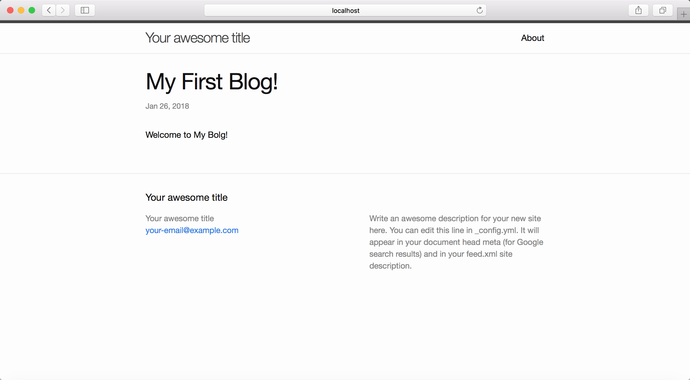

这次我们依旧先review一下我们搭建自己的个人博客要做的三件事。

1. 「[搭建属于自己的博客——GitHub Pages篇]({{ site.url }}/documentation/build-blog-pages.html)」
2. 「[搭建属于自己的博客——Jekyll篇]({{ site.url }}/documentation/build-blog-jekyll.html)」
3. 「[搭建属于自己的博客——Markdown篇]({{ site.url }}/documentation/build-blog-markdown.html)」

我们在「[搭建属于自己的博客——GitHub Pages篇]({{ site.url }}/documentation/build-blog-pages.html)」中已经在GitHub Pages上创建了属于自己主页。在「[搭建属于自己的博客——Jekyll篇]({{ site.url }}/documentation/build-blog-jekyll.html)」中快速搭建了自己的个人博客，并且也将搭建好的博客发布到了之前的https://*username*.github.io域名下接下来写第一篇自己的博文。

我们可以在`_post`文件夹下创建一个名为`YEAR-MONTH-DAY-title.md`的文件。我们将使用Markdown标记语言来写我们的第一遍博文。

## 什么是Markdown

「[Markdown](https://daringfireball.net/projects/markdown/)」是一个针对web写手的文本到html转换工具。Markdown允许您使用易于阅读、易于编写的纯文本格式编写，然后将其转换为结构有效的XHTML(或HTML)。

## 为什么选择Markdown

- 纯文本：兼容性强，所有的编辑器都能打开
- 内容与格式完全分离：写好的内容可以用不同的方式渲染，因此所展现给读者的只是渲染方式不同，而与内容无关。
- 可以轻松转换格式：即便对方看不懂原始的Markdown文件，我们可以轻松的将其转换成PDF或者HTML发布。

因为目前的国内一些比较流行的论坛大多数都不支持Markdown，这也是我选择搭建自己的博客的原因之一。

## Markdown语法

Markdown的语法其实非常简单，即便没有编程基础的萌新，花上30分钟也能轻松掌握。

1. 标题

> \#(空格)一级标题 
> \##(空格)二级标题
> \###(空格)三级标题
> \####(空格)四级标题
> \#####(空格)五级标题
> \######(空格)六级标题

> # 一级标题 
> ## 二级标题
> ### 三级标题
> #### 四级标题
> ##### 五级标题
> ###### 六级标题

2. 列表

> 1.(空格)内容1
> 2.(空格)内容2
> 3.(空格)内容3
> 或者
> -(空格)内容1
> -(空格)内容2
> -(空格)内容3

> 1. 内容1
> 2. 内容2
> 3. 内容3
>   或者
> - 内容1
> - 内容2
> - 内容3

3. 粗体和斜体

> \*\*粗体\*\*
> \*斜体\*

> **粗体**
>
> *斜体*

4. 普通引用


> \>(空格)引用内容

> 引用内容

5. 代码引用

> \``代码引用`\`
>
> ```java
> ​```java
> 多段代码引用
> 多段代码引用
> 多段代码引用
> ​```
> ```

>   `代码引用`
>
>   ```java
>   多段代码引用
>   多段代码引用
>   多段代码引用
>   ```


6. 表格


> \| 标题1   \| 标题2   \| 标题3   \|
> | ----- | ----- | ----- |
> | 内容1.1 | 内容1.2 | 内容1.3 |
> | 内容2.1 | 内容2.2 | 内容2.3 |

> | 标题1   | 标题2   | 标题3   |
> | ----- | ----- | ----- |
> | 内容1.1 | 内容1.2 | 内容1.3 |
> | 内容2.1 | 内容2.2 | 内容2.3 |

7. 链接

> \[Markdown\](https://daringfireball.net/projects/markdown/)
>
> \!\[build-blog-markdown-1\](../assets/img/build-blog-markdown-1.jpg)

> [Markdown](https://daringfireball.net/projects/markdown/)
>
> 

## 发布我们的第一篇博文

熟悉完Markdown的语法，写下第一篇博文，然后执行

```powershell
bundle exec jekyll serve
```

就可以在本地查看我们发布的博文啦。



可以review一下我们文章有没有其他问题，检查完毕后，就可以将code push到remote的repository中。这样在我们的https://*username*.github.io域名下就可以看到我们的第一篇博文了。

## 结尾

通过这三篇文章，我们可以快速搭建起一个我们自己的博客，原始的主题比较简单，我们可以去[Jekyll Themes](http://jekyllthemes.org/)挑选我们比较中意的主题，之后再做一些个性化的改造就可以了。另外推荐一下mac上超好用的Markdown编辑器[Typora](https://typora.io)。我平时都是用这款编辑器来写文章的。

最后再回顾一次：
1. 「[搭建属于自己的博客——GitHub Pages篇]({{ site.url }}/documentation/build-blog-pages.html)」快速搭建了自己的个人站点。
2. 「[搭建属于自己的博客——Jekyll篇]({{ site.url }}/documentation/build-blog-jekyll.html)」将简单的个人站带你快速改造成一个个人博客。
3. 「[搭建属于自己的博客——Markdown篇]({{ site.url }}/documentation/build-blog-markdown.html)」非常便捷的发布我们的第一篇博文。

以上！