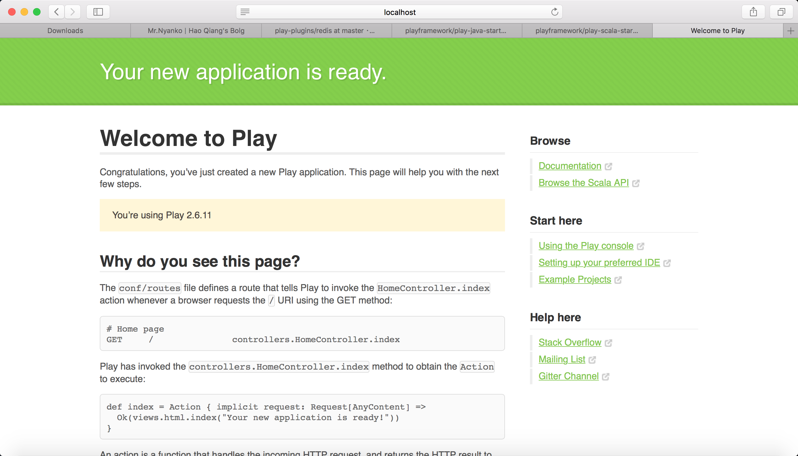

## 关于Play Framework
**「[Play Framework](https://www.playframework.com)」**:

>  The High Velocity Web Framework For Java and Scala.Play Framework makes it easy to build web applications with Java & Scala.

**「Play Framework」**是一个轻量级的web框架，它主要的思路是让开发者简单便捷的搭建一个web应用。并且兼容Java和Scala两种语言。

个人感觉现代的web框架基本上思路都大同小异。Java的web框架现在这么多，不过目前主流都离不开SSI。在使用层面上**「Play Framework」**和**「Spring Boot」**思路也比较接近。在**「Spring Boot」**中封装好了许多的实用的插件，只要在**「Maven」**中引入相应的插件，就可以方便的使用了。而在**「Play Framework」**中有许多**「[module](https://www.playframework.com/documentation/2.6.x/ModuleDirectory#play-modules)」**这些实用的模块也能很方便的引入和使用。总之都是为了把复杂的配置简单化，通过插件或者模块的形式，把需要的组件方便的引入到应用之中。不过对于Scala的支持上必然会选择**「Play Framework」**。而如果选择Java作为开发语言，则更倾向于选择***“Spring全家桶”***。


## 关于SBT

**「[SBT](https://www.scala-sbt.org)」**：

>  The interactive build tool。

**「SBT」**是一个“交互式的”（*interactive*）构建工具。在开发过程中，使用最多的是对引入的包进行管理、定义一些task以及打包。对于Scala的项目，SBT当然是首选的build工具，但是如果项目是Java和Scala的混合项目（虽然我不喜欢混合着用），还是用Maven好一些。顺带一提，SBT的交互模式和Play Console结合起来用。


##Play Starter Projects

以前的**「Play Framework」**提供了一个叫**「activator」**的工具，当时觉得和**「SBT」**有些重叠，估计官方也是觉得多此一举，因此现在已经抛弃了**「activator」**。目前创建Play项目官方提供了两种方法。

1. 从**「[GitHub](https://github.com/playframework/play-scala-starter-example/tree/2.6.x)」**上下载到本地
2. 如果在电脑上已经安装过了*SBT 0.13.13*或者更高的版本那么可以通过sbt new命令创建一个Play的项目。（*[详细步骤](https://www.playframework.com/download)*）
3. 之后运行`sbt run`命令来启动项目。启动后则会出现以下页面。


## The Play application layout

比较重要的是先了解[The Play application layout](https://www.playframework.com/documentation/2.6.x/Anatomy#the-play-application-layout)。
```
app                      → Application sources
 └ assets                → Compiled asset sources
    └ stylesheets        → Typically LESS CSS sources
    └ javascripts        → Typically CoffeeScript sources
 └ controllers           → Application controllers
 └ models                → Application business layer
 └ views                 → Templates
build.sbt                → Application build script
conf                     → Configurations files and other non-compiled resources (on classpath)
 └ application.conf      → Main configuration file
 └ routes                → Routes definition
dist                     → Arbitrary files to be included in your projects distribution
public                   → Public assets
 └ stylesheets           → CSS files
 └ javascripts           → Javascript files
 └ images                → Image files
project                  → sbt configuration files
 └ build.properties      → Marker for sbt project
 └ plugins.sbt           → sbt plugins including the declaration for Play itself
lib                      → Unmanaged libraries dependencies
logs                     → Logs folder
 └ application.log       → Default log file
target                   → Generated stuff
 └ resolution-cache      → Info about dependencies
 └ scala-2.11
    └ api                → Generated API docs
    └ classes            → Compiled class files
    └ routes             → Sources generated from routes
    └ twirl              → Sources generated from templates
 └ universal             → Application packaging
 └ web                   → Compiled web assets
test                     → source folder for unit or functional tests
```
官方对于Play应用的结构解释的很清楚了。个人觉得Play的文档要Spring的文档要清晰很多。毕竟Play比较新，而且把许多配置和API都简化了，找起来很方便。相比Spring的文档感觉是一坨放在那儿。都不知道从何看起...


## 结尾

这一篇主要是对**「[Play Framework](https://www.playframework.com)」**有个简单的了解，更多的还是需要去看官方文档，再次**「赞」**一下官方文档，写的真的很清晰。后续打算从SBT构建项目开始一步一步的写出一个可以使用的Web应用。