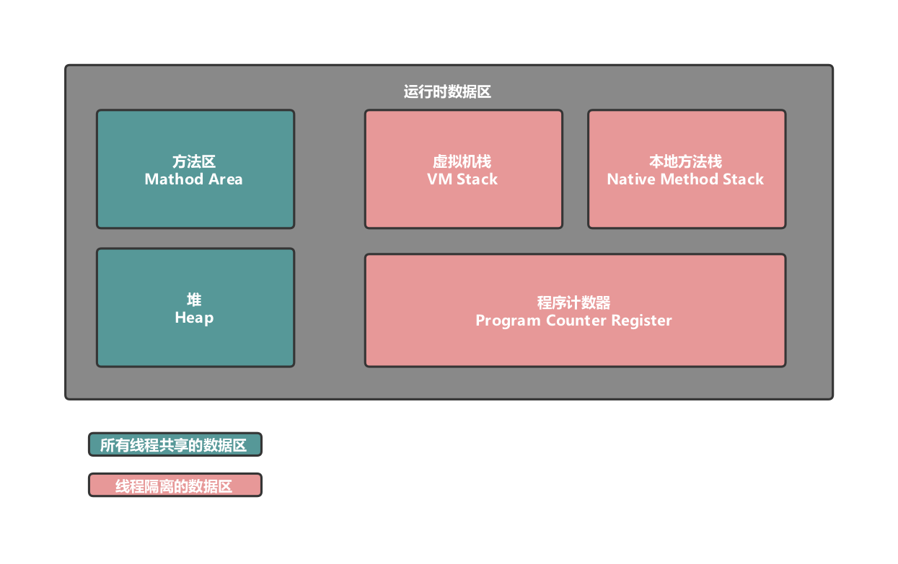

## Java内存区域
Java虚拟机在执行Java程序的过程中会把它所管理的内存划分为若干个不同的数据区域，这些区域都有各自的用途，以及创建和销毁时间。

- 【程序计数器】：是一块较小的内存空间，可以看作是当前线程所执行的字节码行号指示器。在虚拟机的概念模型里，字节码解释器工作时就是通过改变这个计数器的值，来选取下一条需要执行的字节码指令。

  由于Java虚拟机的多线程是通过线程轮流切换并分配处理器的执行时间的方式来实现的，在任何一个确定的时刻，一个处理器（对于多核处理器来说是一个内核）都只会执行一条线程中的指令。因此，为了线程切换后，能够恢复到正确的执行位置，每条线程都需要一个独立的线程计数器，各条线程之间的计数器互不影响，独立存储，我们称这类内存区域为“线程私有”的内存。

  此内存区域是唯一一个在Java虚拟机规范中没有规定任何`OutOfMemoryError`情况的区域。

- 【Java虚拟机栈】：与程序计数器一样，Java虚拟机栈也是线程私有的，它的生命周期和线程相同。虚拟机栈描述的是Java方法执行的内存模型：每个方法在执行同时都会创建一个栈帧用于存储局部变量表，操作数栈，动态链接，方法出口等信息。每一个方法从调用直至执行完成的过程，就对应着一个栈帧在虚拟机栈中入栈到出栈的过程。

  经常有人把Java内存区分为对内存和栈内存，这种分法比较粗糙，Java内存区域的划分实际上远比这复杂。这种划分方式的流行只能说明大多数程序员最关注的，与对象内存分配关系最密切的内存区域就是这两块。

  在Java虚拟机规范中，对这个区域规定了两种异常状况：如果线程请求的栈深度大于虚拟机允许的深度，将抛出`StackOverFlowError`异常；如果虚拟机栈可以动态扩展，如果扩展时无法申请到足够的内存，就会抛出OutOfMemoryError异常。

- 【本地方法栈】：本地方法栈与虚拟机方法栈所发挥的作用非常相似，他们之间的区别不过是虚拟机栈为虚拟机执行Java方法服务，而本地方法栈则为虚拟机使用到的Native方法服务。

  与虚拟机栈一样，本地方法栈区域也会抛出`StackOverFlowError`和`OutOfMemoryError`异常。

- 【Java堆】：Java堆是被所有线程共享的一块内存区域，在虚拟机启动时创建。次内存区的唯一目的就是存放对象实例。

  Java堆是来及收集器管理的主要区域。从内存回收的角度来看，由于现代收集器基本都采用了分代收集算法，所以Java堆还可以细分为：新生代和老年代：再细致一点的有`Eden`空间，`From Survivor`空间、`To Servivor`空间等。

  当前主流的虚拟机都是可以扩展堆空间的，如果在堆中没有内存完成实例分配，并且也无法再扩展时，将会抛出`OutOfMemoryError`异常。

- 【方法区】：方法区与Java堆一样，是各个线程共享的内存区域，它用于存储已被虚拟机加载的类信息、常量、静态变量、即使编译器编译后的代码等数据。

  对于习惯在HotSpot虚拟机上开发，部署程序的开发者来说，很多人愿意把方法区称为“永久代”，本质上两者并不等价，仅仅是因为HotSpot虚拟机的设计团队选择把GC分代收集扩展至方法区，或者说使用永久代来实现方法区而已，这样HotSpot的垃圾收集器可以像管理Java堆一样管理这部分内存。

  根据Java虚拟机规范的规定，当方法区无法满足内存分配的需求时，将抛出`OutOfMemoryError`异常。

  ​

## Java对象在heap中的状态
Java对象在堆中的状态与垃圾回收紧密相关，关于垃圾回收后面会有专门的文章进行介绍。
1. 【可触及状态】：从根节点开始，可以搜索到这个对象，也就是说这个对象可以被访问到。
2. 【可复活状态】：从根节点开始，无论如何也不能访问到这个对象，也就是说这个对象的所有引用都已经被释放，没有任何变量引用该对象了。
  但是该对象可能在`finalize()`方法中被再次引用，从而复活。
3. 【不可触及状态】：对象的引用都被释放了，并且在对象的`finalize()`方法中没有复活，这样的话，该对象就是不可触及状态。

关于【不可触及状态】所有的对象都有`finalize()`方法，并且该方法只执行一次，并且他的执行时间是随机的，一般在我们为变量赋值`null`之后执行。
如果我们在某个对象的`finalize()`方法中为他增加引用，那么该对象就会复活，但是我们再次将其赋值为`null`，将不会再执行`finalize()`方法。

## OutOfMemory异常
在Java虚拟机规范的描述中，除了程序计数器外，虚拟机内存的其他几个运行时区域都有发生OutOfMemory（OOM）的可能。

- 【Java堆益处】：Java堆用于存储对象实例，只要不断地创建对象，并且保证GC Roots到对象之间有可达路径来避免垃圾回收机制清除这些对象，那么在对象数量达到最大堆的容量限制后就会产生内存溢出异常。

  Java堆内存的OOM异常是实际应用中常见的内存溢出异常情况。当出现Java堆内存溢出时，异常堆栈信息`java.lang.OutOfMemoryError`会跟着进一步提示`Java heap space`。

  堆溢出重点是确认内存中的对象是否是必要的，也就是要先分清楚到底是出现了内存泄漏（Memory Leak）还是内存溢出（Memory OverFlow）。

- 【虚拟机栈和本地方法栈溢出】：在Java虚拟机规范中描述了两种异常：如果线程请求的栈深度大于虚拟机所允许的最大深度，将抛出`StackOverflowError`异常；如果虚拟机再扩展栈时无法申请到足够的空间，则抛出`OutOfMemoryError`异常。一般情况下都会抛出`StackOverflowError`异常。

- 【方法区和运行时常量池溢出】：运行时常量池是方法区的一部分，当运行时常量池溢出时，会抛出`OutOfMemoryError`异常后面跟随的提示信息时`PermGen space`。过多的创建常量会使运行时常量池溢出，过多的动态创建类，则可能出现方法区溢出。