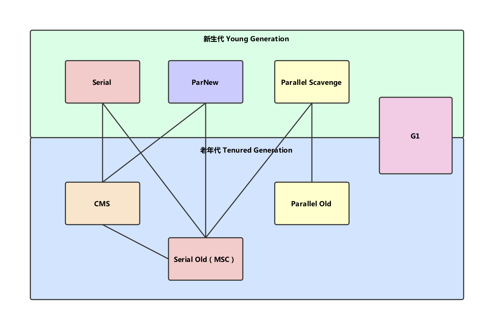

收集算法是内存回收的方法论，垃圾收集器则是内存回收的具体实现。

下图展示了7种作用于不同年代的收集器，两个收集器存在连线，则说明它们可以搭配使用。虚拟机所处的区域则表示它是属于新生代还是老年代的收集器。

- 【Serial收集器】：Serial收集器是最基本，发展历史最悠久的收集器。
  - 新生代收集器，采用复制算法
  - 单线程收集
  - 会发生“Stop-The-World”
  - 是运行在Client模式下的默认新生代收集器
- 【ParNew收集器】：ParNew收集器是Serial收集器的多线程版本。
  - 新生代收集器，采用复制算法
  - 多线程收集
  - 会发生“Stop-The-World”
  - 是运行在Server模式下的默认新生代收集器
- 【Parallel Scavenge收集器】：与ParNew很相似，不同之处是吞吐量优先的收集器。自适应调节策略是Parallel Scavenge收集器与ParNew收集器的一个重要区别。
  - 新生代收集器，采用复制算法
  - 多线程收集
  - 会发生“Stop-The-World”
  - 吞吐量优先
- 【Serial Old收集器】：Serial Old收集器是Serial收集器的老年代版本。
  - 老年代收集器，采用标记-整理算法
  - 单线程收集
  - 会发生“Stop-The-World”
  - 在Client模式下使用
- 【Parallel Old收集器】：是Parallel Scavenge收集器的老年代版本
  - 老年代收集器，采用标记-整理算法
  - 多线程收集
  - 会发生“Stop-The-World”
  - 吞吐量优先
- 【CMS收集器】：CMS收集器是一种以获取最短回收停顿时间为目标的收集器。
  - 老年代收集器，采用标记-清除算法
  - 初始标记、并发标记、重新标记、并发清除
  - 初始标记和重新标记会“Stop-The-World”
  - 缺点：对CPU资源敏感、无法处理浮动垃圾（易触发Full GC）、大量空间碎片产生
- 【G1收集器】：G1是一款面向服务端应用的垃圾收集器。
  - 并行与并发、通过使用多个CPU来缩短“Stop-the-World“的时间
  - 分代收集
  - 空间整合
  - 可预测的停顿