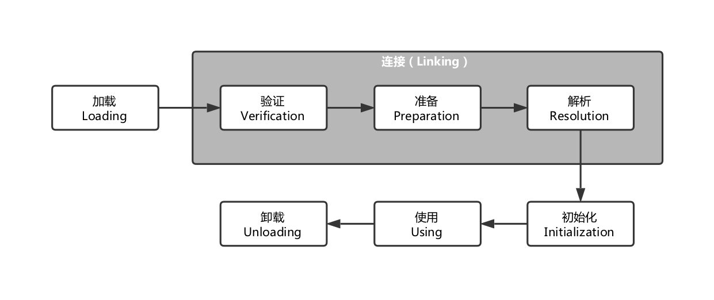
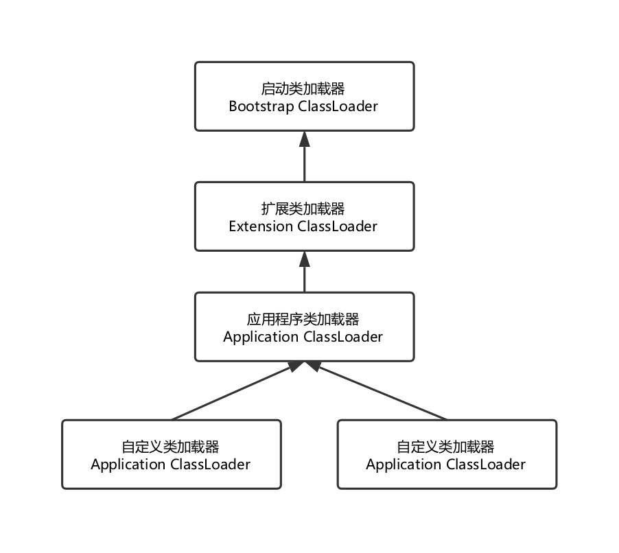

虚拟机把描述类的数据从Class文件加载到内存，并对数据进行校验、转换解析和初始化，最终形成可以被虚拟机直接使用的Java类型，这就是虚拟机的类加载机制。

与那些在编译时期需要进行连接工作的语言不同，在Java语言里，累的加载、连接和初始化过程都是在程序运行期间完成的，这种策略虽然会令类加载稍微增加一些性能开销，但是会为Java应用程序提供高度的灵活性，Java里天生可以动态扩展的语言特性就是依赖运行时期动态加载和动态链接这个特点实现的。

## 类加载的时机
类从被加载到虚拟机内存中开始，到卸载出内存为止，它的整个生命周期包括：加载（Loading）、验证（Verification）、准备（Preparation）、解析（Resolution）、初始化（Initialization）、使用（Using）和卸载（UnLoading）7个阶段。其中验证、准备和解析3个部分统称为连接（Linking）。

## 类加载的过程

- 【加载】：在加载阶段，虚拟机要完成以下三件事：

  1. 通过一个类的全限定名来获取定义此类的二进制字节流。

    这里的二进制字节流不一定要从一个Class文件中获取，也可以从ZIP包中、网络中、运行时计算生成（动态代理技术）、其他文件（如JSP）甚至数据库中获取。

  2. 将这个字节流所代表的静态存储结构转化为方法区的运行时数据结构。

  3. 在内存中生成一个代表这个类的`java.lang.Class`对象，作为方法区这个类的各种数据的访问入口。（并没有明确规定是在Java堆中，对于HotSpot虚拟机而言，Class对象比较特殊，他虽然是对象，但是存放在方法区里）

- 【验证】：验证时连接阶段的第一步，这一阶段的目的是为了确保Class文件的字节流中包含的信息符合当前虚拟机的要求，并且不会危害虚拟机自身的安全。验证阶段是非常重要的，这个阶段是否严谨，直接决定了Java虚拟机能否承受恶意代码的攻击，从执行性能的角度上，验证阶段的工作量在虚拟机的类加载子系统中又占了相当大的一部分。

  1. 文件格式验证：主要验证字节流是否符合Class文件格式规范，并且能被当前版本的虚拟机处理。
  2. 元数据验证：对字节码描述的信息进行语义分析，保证其描述的信息符合Java语言规范的要求。
  3. 字节码验证：主要目的是通过数据流和控制流分析，确定程序语意是合法的，符合逻辑的。
  4. 符号引用验证：目的是确保解析动作能正常执行。

- 【准备】：准备阶段是正式为类变量分配内存并设置类变量初始值的阶段，这些变量所使用的内存都将在方法区中进行分配。

  这个阶段有两个容易混淆的概念：

  1. 这个时候进行内存分配的仅包括类变量（被**static**修饰的变量），而不包括实例变量，实例变量将会在对象实例化时随着对象一起分配在Java堆中。
  2. 这里说的初始值“通常情况下”是数据类型的零值。

- 【解析】：解析阶段时虚拟机将常量池内的符号引用替换为直接引用的过程。

  - 符号引用：符号引用以一组符号来描述所引用的目标，符号可以是任何形式的字面量，只要使用时无歧义地定位到目标即可。符号引用与虚拟机实现的内存布局不管，引用的目标不是一定已经加载到内存中。各种虚拟机实现的内存布局可以各不相同，但是它们能接受的符号引用必须都是一致的，因为符号引用的字面量形式明确定义在Java虚拟机规范的Class文件格式中。
  - 直接引用：直接引用可以是直接指向目标的指针、相对偏移量或是一个能间接定位到目标的句柄。直接引用是和虚拟机实现的内存布局相关的，同一个符号引用能在不同的虚拟机实例上翻译出来的直接引用一般不会相同。如果有了直接引用，那引用的目标必定已经在内存中存在。

- 【初始化】：类初始化阶段时类加载过程的最后一步，前面的类加载过程中，除了在加载阶段用户应用程序可以通过自定义类加载器参与外，其余动作完成全由虚拟机主导和控制。到了初始化阶段才是真正开始执行类中定义的Java程序代码（或者说是字节码）。

  在准备阶段，变量已经赋过一次系统要求的初始值，而在初始化阶段，则根据程序员通过程序制定的主观计划区初始化类的变量和其他资源。

## 类加载器

虚拟机设计团队把类加载阶段中的“通过一个累的全限定名来获取此类的二进制字节流”这个动作放到Java虚拟机外部去实现，以便让应用程序自己决定如何区获取所需要的类。实现这个动作的代码块称为“类加载器”。

#### 类与类加载器

类加载器虽然只用于实现类的加载动作，但他在Java程序中起到的作用却远远不限于类加载阶段。对于任意一个类，都需要由加载它的类加载器和这个类本身一同确立其在Java虚拟机中的唯一性，每一个类加载器，都拥有一个独立的类命名空间。

比较两个类是否“相等”，只有在这两个类是由同一个类加载器加载的前提下才有意义，否则，即使这个类来源于同一个Class文件，被同一个虚拟机加载，只要加载它的类加载器不同，那这两个类就必定不相同。

#### 双亲委派模型

从Java虚拟机的角度来讲，只存在两种不同的类加载器：一个是启动类加载器（Bootstrap ClassLoader），这个类加载器使用C++语言实现，是虚拟机自身的一部分；另一种就是所有其他的类加载器，这些类加载器都是由Java语言实现的，独立于虚拟机外部，并且全都继承自抽象类`java.lang.ClassLoader`

从Java开发人员的角度来看，可以划分的更细致一些：

- 启动类加载器（Bootstrap ClassLoader）
- 扩展类加载器（Extension ClassLoader）
- 应用程序类加载器（Application ClassLoader）

双亲委派模型的工作过程是：如果一个类加载器收到了类加载的请求，他首先不会自己去尝试加载这个类，而是把这个请求委派给父类加载器去完成，每一个层次的类夹杂器都是如此，因此所有的类加载器请求最终都应该传送到顶层的启动类加载器中，只有当腹加载器反馈自己无法完成这个加载请求（它的搜索范围中没有找到所需要的类）时，子加载器才会尝试自己去加载。