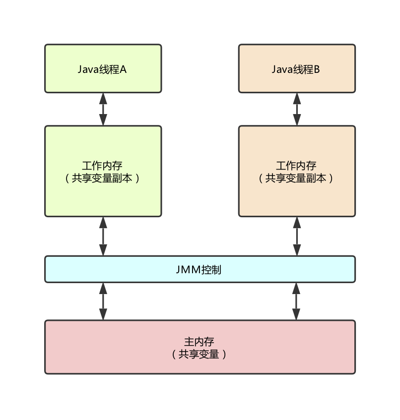

Java代码在编译后会变成Java字节码，字节码被类加载器加载到JVM里，JVM执行字节码，最终需要转化为汇编指令在CPU上执行，Java中所使用的并发机制依赖于JVM的实现和CPU的指令。

## volatile

在多线程并发编程中synchronized和volatile都扮演着重要角色，volatile是轻量级的synchronized，它在多处理器开发中保证了共享变量的“可见性”。可见性的意思是当一个线程修改一个共享变量时，另外一个线程能读到这个修改的值。如果volatile变量修饰符使用恰当的话，它比synchronized的使用和执行成本更低，因为它不会引起线程上下文的切换和调度。

## synchronized

在多线程并发编程中synchronized一直是元老级角色，很多人都会称呼它为重量级锁。Java中每一个对象都可以作为锁。具体表现为以下三种形式。

- 对于普通的同步方法，锁的是当前实例的对象。
- 对于静态同步方法，锁的是当前类的Class对象。
- 对于同步方法块，锁的是synchronized括号里配置的对象。