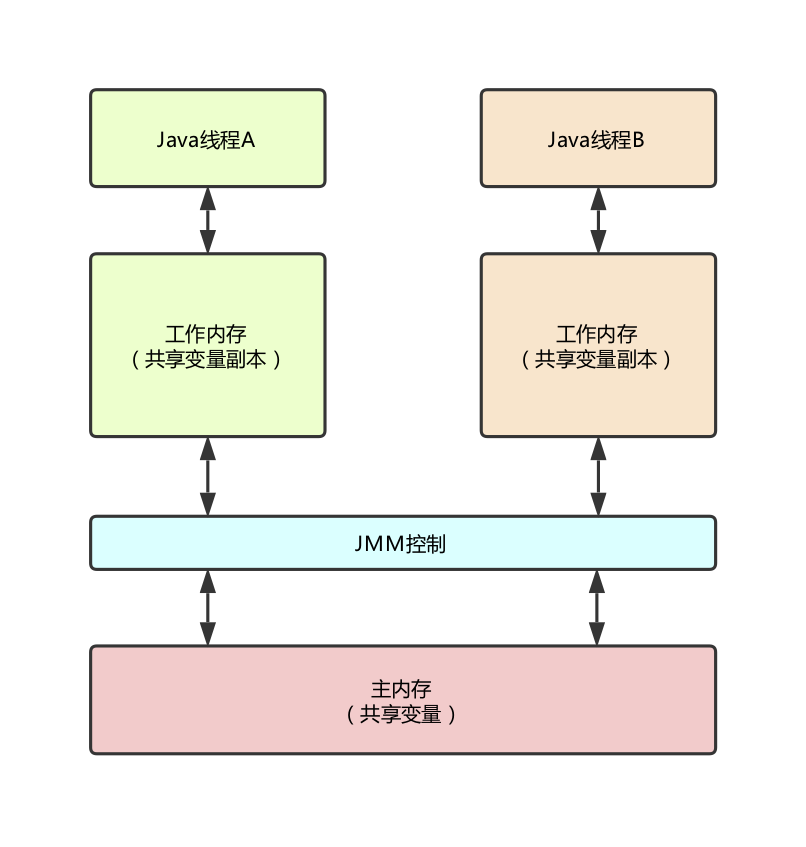

## Java内存模型的基础

- 【**Java内存模型的抽象结构**】：

- 【**从源代码到指令序列的重排序**】：在执行程序时，为了提高性能，编译器和处理器常常会对指令做重排序。重排序分为三种类型：

  1. 编译器优化的重排序。编译器在不改变单线程程序语义的前提下，可以重新安排语句的执行顺序。
  2. 指令集并行的重排序。现代冲利器采用了指令级并行技术来将多条指令重叠执行。如果不存在数据依赖性，处理器可以改变语句对应机器指令的执行顺序。
  3. 内存系统的重排序。由于处理器使用缓存和读/写缓冲区，这使得加载和存储操作看上去可能是乱序执行

## 重排序

重排序是指编译器和处理器为了优化程序性能而对指令序列进行重新排序的一种手段。

## 顺序一致性

顺序一致性内存模型是一个理论参考模型，在设计的时候，处理器的内存模型和编程语言的内存模型都会以顺序一致性内存模型作为参考。

## volatile的内存语义

## 锁的内存语义

## final域的内存语义

## happens-before

## 双重检查锁与延迟初始化

## Java内存模型综述

