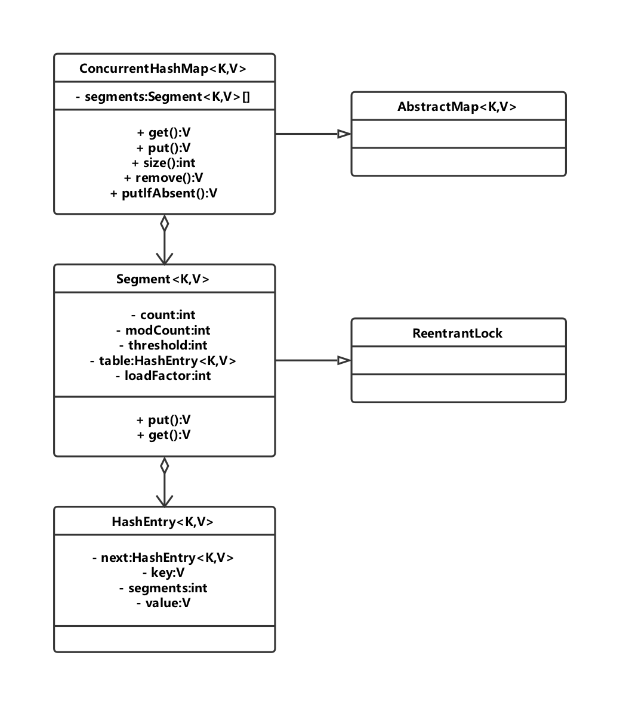
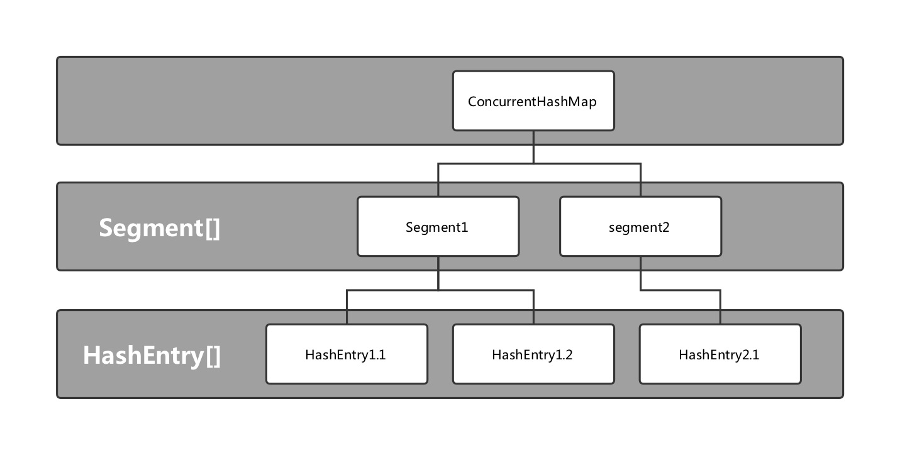
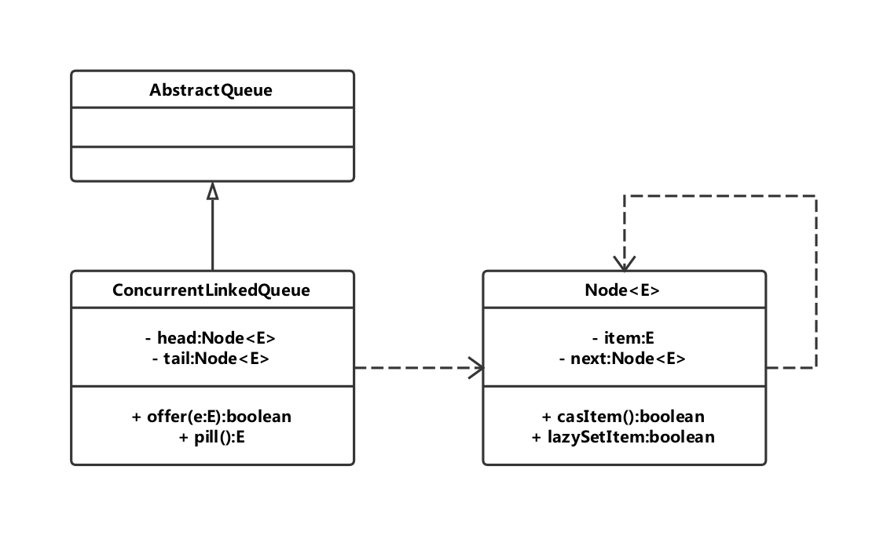

## ConcurrentHashMap的实现原理与使用

ConcurrentHashMap是线程安全且高效的HashMap。

1. **为什么要使用ConcurrentHashMap**

   在并发编程中使用HashMap可能导致程序死循环。而使用线程安全的HashTable效率又非常低下，基于以上两个原因，便于有了ConcurrentHashMap登场的机会。

   1. 线程不安全的HashMap

      在多线程环境下，使用HashMap进行put操作会引起死循环，导致CPU利用率接近100%，所以在并发的情况下不能使用HashMap。

      HashMap在并发执行put操作时会引起死循环，是因为多线程会导致HashMap的Entry链表形成环形数据结构，一旦形成环形数据结构，Entry的next节点永远不为空，就会产生死循环获取Entry。

   2. 效率低下的HashTable

      HashTable容器使用synchronized来保证线程安全，但在线程竞争激烈的情况下HashTable的效率非常低下。因为当一个线程访问HashTable的同步方法，其他线程也访问HashTable的同步方法，会进入阻塞或轮询状态。如线程1使用put进行元素添加，线程2不但不能使用put方法添加元素，也不能使用get方法来获取元素，所以竞争越激烈效率越低。

   3. ConcurrentHashMap的锁分段技术可有效提升并发访问率

      HashTable容器在竞争激烈的并发环境下表现出效率低下的原因是所有访问HashTable的线程都必须竞争同一把锁，假如容器里又多把锁，每一把锁用于锁容器其中一部分数据，那么当多线程访问容器里不同数据段的数据时，线程间就不会存在锁竞争，从而可以有效提高并发访问率，这就是ConcurrentHashMap所使用的锁分段技术。首先将数据分成一段一段地存储，然后给每一段数据配一把锁，当一个线程占用锁访问其中一个段数据的时候，其他段的数据也能被其他线程访问。

2. **ConcurrentHashMap的结构**

   通过ConcurrentHashMap的类图来分析ConcurrentHashMap的结构。

   ConcurrentHashMap是由Segment数组结构组成。Segment是一种可重入锁（ReentrantLock），在ConcurrentHashMap里扮演锁的角色；HashEntry则用于存储健值对数据。一个ConcurrentHashMap里包含一个Segment数组。Segment结构和HashMap类似，是一种数组和链表的结构。一个Segment里包含一个HashEntry数组，每个HashEntry是一个链表结构的元素，每个segment守护着一个HashEntry数组里的元素，当对HashEntry数组的数据进行修改时，必须首先获得与它对应的Segment锁。
   

## ConcurrentLinkedQueue

在并发编程中，有时候需要使用线程安全的队列。如果要实现一个线程安全的队列有两种方式：一种是使用阻塞算法，另一种是使用非阻塞算法。使用阻塞算法的队列可以用一个锁（入队和出队用同一把锁）或两个锁（入队和出队不同的锁）等方式来实现。非阻塞的实现方式则可以使用循环CAS的方式来实现。

ConcurrentLinkedQueue是一个基于链接节点的无界线程安全队列，它采用先进先出的规则对节点进行排序，当我们添加一个元素的时候，它会添加到队列的尾部；当我们获取一个元素时，他会返回队列头部的元素。它采用"wait-free"算法（即CAS算法）来实现。

1. **ConcurrentLinkedQueue的结构**

   ConcurrentLinkedQueue类图如下：
   
   ConcurrentLinkedQueue由head节点和tail节点组成，每个节点（Node）由节点元素（item）和指向下一个节点（next）的引用组成，节点与节点之间就是通过这个next关联起来，从而组成一张链表结构的队列。默认情况下head节点存储的元素为空，tail节点等于head节点。

   ```java
   private transient volatile Node<E> tail = head;
   ```

2. **入队列**

3. **出队列**

## Java中的阻塞队列

1. **什么是阻塞队列**

   阻塞队列（BlockingQueue）是一个支持两个附加操作的队列。这两个附加的操作支持阻塞的插入和移除方法。

   1. 支持阻塞的插入方法：意思是当队列满时，队列会阻塞插入元素的线程，直到队列不满。
   2. 支持阻塞的移除方法：意思是在队列为空时，获取元素的线程会等待队列变为非空。

   阻塞队列常用于生产者和消费者的场景，生产者是向队列里添加元素的线程，消费者时从队列里去元素的线程。阻塞队列就是生产者用来存放元素、消费者用来获取元素的容器。

   在阻塞队列不可用时，两个附加操作提供了4中处理方式。

   - 抛出异常：当队列满时，如果再往队列里插入元素，会抛出`IllegalStateException("Queue full")`异常。当队列空时，从队列里取元素会抛出`NoSuchElementException`异常。
   - 返回特殊值：当往队列插入元素时，会返回元素是否插入成功，成功返回true。如果是移除方法，则是从队列里取出一个元素，如果没有则返回null。
   - 一直阻塞：当阻塞队列满时，如果生产者线程往队列里put元素，队列会一直阻塞生产者线程，直到队列可用或者响应中断退出。当队列空时，如果消费者线程从队列里take元素，队列会阻塞住消费者线程，直到队列不为空。
   - 超时退出：当阻塞队列满时，如果生产者线程往队列里插入元素，队列会阻塞生产者线程一段时间，如果超过了指定的时间，生产者线程就会退出。
   
| 方法/处理方式 | 抛出异常  | 返回特殊值 | 一直阻塞 | 超时退出           |
| ------------- | --------- | ---------- | -------- | ------------------ |
| 插入方法      | add(e)    | offer(e)   | put(e)   | offer(e,time,unit) |
| 移除方法      | remove()  | poll()     | take()   | poll(time, unit)   |
| 检查方法      | element() | peek()     | 不可用   | 不可用             |

2. **Java里的阻塞队列**

   - ArrayBlockingQueue：一个由数组结构组成的有界阻塞队列。
   - LinkedBlockingQueue：一个由链表结构组成的有界阻塞队列。
   - PriorityBlockingQueue：一个支持优先级排序的无界阻塞队列。
   - DelayQueue：一个使用优先级队列实现的无阻塞队列。
   - SynchronousQueue：一个不存储元素的阻塞队列。
   - LinkedTransferQueue：一个由链表结构组成的无界阻塞队列。
   - LinkedBlockingDeque：一个由链表结构组成的双向阻塞队列。

   1. **ArrayBlockingQueue**

      ArrayBlockingQueue是一个用数组实现的有界阻塞队列。此队列按照先进先出（FIFO）的原则对元素进行排序。

      默认情况下不保证线程公平的访问队列，所谓公平访问队列是指阻塞的线程，可以按照阻塞的先后顺序访问队列，即先阻塞线程先访问队列。非公平性是先等待的线程是非公平的，当队列可用时，阻塞的线程都可以争夺访问队列的资格，有可能先阻塞的线程最后才访问队列。为了保证公平性，通常会降低吞吐量。访问者的公平性时使用可重入锁实现的。

   2. **LinkedBlockingQueue**

      LinkedBlockingQueue是一个用链表实现的有界阻塞队列。此队列的默认和最大长度为Integer.MAX_VALUE。此队列按照先进先出的原则对元素进行排序。

   3. **PriorityBlockingQueue**

      PriorityBlockingQueue是一个支持优先级的无界阻塞队列。默认情况下元素采取自然顺序生序排列，也可以自定义实现compareTo()方法来指定元素的排序规则，或者初始化PriorityBlockingQueue时，指定构造参数Comparator来对元素进行排序。需要注意的是不能保证同优先级元素的顺序。

   4. **DelayQueue**

      DelayQueue是一个支持延时获取元素的无界阻塞队列。队列使用PriorityQueue来实现。队列中的元素必须实现Delayed接口，在创建元素时可以指定多久才能从队列中获取当前元素。只有在延迟期满时才能从队列中提取元素。

      DelayQueue非常有用，可以将DelayQueue运用在以下应用场景。

      - 缓存系统的设计：可以用DelayQueue保存缓存元素的有效期，使用一个线程循环查询DelayQueue，一旦能从DelayQueue中获取元素时，表示缓存有效期到了。
      - 定时任务调度：使用DelayQueue保存当天将会执行的任务和执行时间，一旦从DelayQueue中获取到任务就开始执行，比如TimerQueue就是使用DelayQueue实现的。

   5. **SynchronousQueue**

      SynchronousQueue是一个不存储元素的阻塞队列。每一个put操作必须等待一个take操作，否则不能继续添加元素。

      它支持公平访问队列。默认情况下线程采用非公平性策略访问队列。使用以下构造方法可以创建公平性访问的SynchronousQueue，如果设置为true，则等待线程会采用先进先出的顺序访问队列。

      ```java
      public SynchronousQueue(boolean fair){
          transfere = fair ? new TransferQueue() : new TransferStack();
      }
      ```

      SynchronousQueue可以看成是一个传球手，负责把生产者线程处理的数据直接传递给消费者线程。队列本身不存储任何元素，非常适合传递性场景。SynchronousQueue的吞吐量高于LinkedBlockingQueue和ArrayBlockingQueue。

   6. **LinkedTransferQueue**

      LinkedTransferQueue是一个由链表结构组成的无界阻塞TransferQueue队列。相对于其他阻塞队列，LinkedTransferQueue多了tryTransfer和transfer方法。

      - transfer方法

        如果当前有消费者正在等待接收元素（消费者使用take()方法或带时间限制的poll()方法时），transfer方法可以把生产者传入的元素立刻transfer（传输）给消费者。如果没有消费者等待接收元素，transfer方法会将元素存放在队列的tail节点，并等到该元素被消费者消费了才返回。

      - tryTransfer方法

        tryTransfer方法是用来试探生产者传入的元素是否能直接传递给消费者。如果没有消费者等待接收元素，则返回false。和transfer方法的区别是tryTransfer方法无论消费者是否接收，方法立即返回，而transfer方法是必须等到消费者消费了才返回。

        对于带有时间限制的tryTransfer(E e, long timeout, TimeUnit unit)方法，试图把生产者传入的元素直接给消费者，但是如果没有消费者消费该元素则等待指定的时间再返回，如果超时还没消费元素，则返回false，如果在超时时间内消费了元素，则返回true。

   7. **LinkedBlockingDeque**

      LinkedBlockingDque是一个由链表结构组成的双向阻塞队列。所谓双向队列指的是可以从队列的两端插入和移出元素。双向队列因为多了一个操作队列的入口，在多线程同时入队时，也就减少了一半的竞争。相比其他阻塞队列，LinkedBlockingDeque多了addFirst、addLast、offerFirst、offerLast、peekFirst和peekLast等方法。以First结尾的方法，表示插入、获取（peek）或移除双端队列的第一个元素。以Last单词结尾的方法，表示插入、获取或移除双端队列的最后一个元素。另外，插入方法add等同于addList，移除方法remove等效于removeFirst。但是take方法却等同于takeFirst。在初始化LinkedBlockingDeque时可以设置容量防止其过度膨胀。另外，双向阻塞队列可以运用在"工作窃取"模式中。

3. **阻塞队列的实现原理**

   使用通知模式实现。所谓通知模式，就是当生产者往满的队列里添加元素时会阻塞住生产者，当消费者消费了一个队列中的元素后，会通知生产者当前队列可用。

## Fork/Join框架

1. **什么是Fork/Join框架**

   Fork/Join框架是Java7提供的一个用于并行执行任务的框架，是一个把大任务分割成若干个小任务，在最终汇总每个小任务结构后得到大任务结果的框架。

2. **工作窃取算法**

   工作窃取（work-stealing）算法是指某个线程从其他队列里窃取任务来执行。那么，为什么需要使用工作窃取算法呢？假如我们需要做一个比较大的任务，可以把这个任务分割为若干互不依赖的子任务，为了减少线程间的竞争，把这些子任务分别放在不同的队列里，并为每个队列创建一个单独的线来执行队列里的任务，线程和队列一一对应。比如A线程负责处理A队列里的任务。但是，有的线程会先把自己队列里的任务干完，而其他线程对应的队列里还有任务等待处理。干完活儿的线程与其等着，不如去帮其他线程干活，于是它就去其他线程的队列里窃取一个任务来执行。而在这时它们会访问同一个队列，所以为了减少窃取任务线程和被窃取任务线程之间的竞争，通常会使用双端队列，被窃取任务线程永远从双端队列的头部拿任务执行，而窃取任务的线程永远从双端队列的尾部拿任务执行。

   - 工作窃取算法的优点：充分利用线程进行并行计算，减少了线程间的竞争。
   - 工作窃取算法的缺点：在某些情况下还是存在竞争，比如双端队列里只有一个任务时。并且算法会消耗了更多的系统资源，比如创建多个线程和多个双端队列。

3. **Fork/Join框架的设计**

   1. 步骤1：分割任务。首先我们需要一个fork类把大任务分割成子任务，有可能任务还是很大，所以还需要不停地分割，直到分割出的子任务足够小。

   2. 步骤2：执行任务并合并结果。分割的子任务分别放在双端队列里，然后几个启动线程分别从双端队列里获取任务执行。子任务执行完的结果都统一放在一个队列里，启动一个线程从队列里拿数据，然后合并这些数据。

      Fork/Join使用两个类来完成以上两件事情。

      1. Fork/JoinTask：我们使用ForkJoin框架，必须首先创建一个ForkJoin任务。它提供在任务中执行fork()和join()操作的机制。通常情况下，我们不需要直接继承ForkJoinTask类，只需要继承它的子类，Fork/Join框架提供了以下两个子类。

         - RecursiveAction：用于没有返回结果的任务。
         - RecursiveTask：用于有返回结果的任务。

      2. ForkJoinPool：ForkJoinTask需要通过ForkJoinPool来执行。

         任务分割出的子任务会添加到当前工作线程所维护的双端队列中，进入队列的头部。当一个工作线程的队列里暂时没有任务时，他会随机从其他工作线程的队列的尾部获取一个任务。