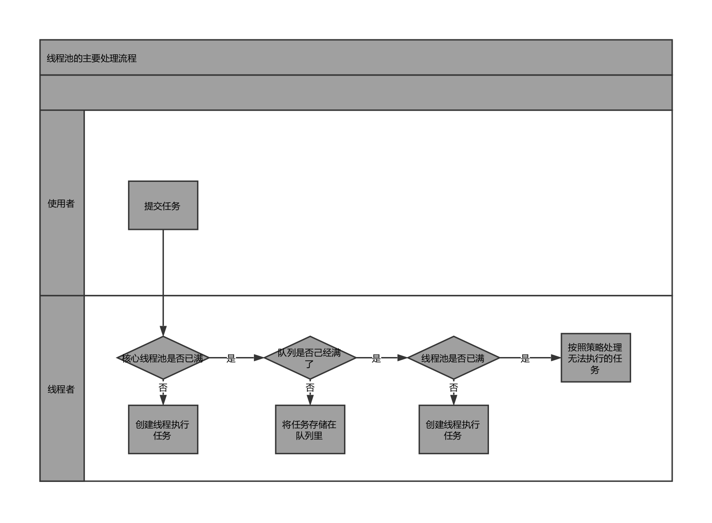

Java中的线程池是运用场景最多的并发框架，几乎所有需要一步或并发执行任务的程序都可以使用线程池。在开发过程中，合理使用线程池能够带来3个好处。

1. **降低资源消耗**。通过重复利用已创建的线程降低线程创建和销毁造成的消耗。
2. **提高响应速度**。当任务到达时，任务可以不需要等到线程创建就能立即执行。
3. **提高线程的可管理性**。线程是稀缺资源，如果无限制地创建，不仅会消耗系统资源，还会降低系统的稳定性，使用线程池可以进行统一分配、调优和监控。

## 线程池的实现原理
从图中可以看出，当提交一个新任务到线程池时，线程池的处理流程如下。

1. 线程池判断核心线程池里的线程是否都在执行任务。如果不是，则创建一个新的工作线程来执行任务。如果线程池里的线程都在执行任务，则进入下一流程。
2. 线程池判断工作队列是否已经满。如果工作队列没有满，则将新提交的任务存储在这个工作队列里。如果工作队列满了，则进入下一流程。
3. 线程池判断线程池的线程是否都处于工作状态。如果没有，则创建一个新的工作线程来执行任务。如果已经满了，则交给饱和策略来处理这个任务。

TreadPoolExecutor执行execute方法分下面4种情况：

1. 如果当前运行的线程少于corePoolSize，则创建新线程来执行（*ps：这一步需要获取全局锁*）。
2. 如果运行的线程等于或者多于corePoolSize，则将任务加入BlockingQueue。
3. 如果无法将任务加入BlockingQueue（队列已满），则创建新的线程来处理任务（*ps：执行这一步需要获取全局锁*）。
4. 如果创建新线程将使当前运行的线程超过maximumPoolSize，任务将被拒绝，并调用RejectedExecutionHandler.rejectExecution()方法。

## 线程池的使用

通过TreadPoolExecutor来创建线程池。

```java
new TreadPoolExecutor(corePoolSize, maximumPool, keepAliveTime, milliseconds, runnableTaskQueue, handler);
```

创建线程池时需要输入几个参数，如下：

1. **corePoolSize（线程池的基本大小）**：当提交一个任务到线程池时，线程池会创建一个线程来执行任务，即使其他空闲的基本线程能够执行新任务也会创建线程，等到需要执行的任务数大于线程池基本大小时就不再创建。如果调用了线程池的prestartAllCoreThreads()方法，线程池会提前创建并启动所有基本线程。

2. **runnableTaskQueue（任务队列）**：用于保存等待执行的任务的阻塞队列。可以选择以下几个阻塞队列：
   - ArrayBlockingQueue：是一个基于数组结构的有界阻塞队列，此队列按FIFO原则对元素进行排序。
   - LinkedBlockingQueue：一个基于链表结构的阻塞队列。此队列按FIFO排序元素，吞吐量通常高于ArrayBlockingQueue。静态工厂方法Executors.newFixedTreadPool()使用了这个队列。
   - SynchronousQueue：一个不存储元素的阻塞队列。每个插入操作必须等到另一个线程调用移除操作，否则插入操作一只处于阻塞状态，吞吐量通常高于LinkedBlockingQueue，静态工厂方法Executors.newCachedTreadPool使用了这个队列。
   - PriorityBlockingQueue：一个具有优先级的无限阻塞队列。

3. **maximumPoolSize（线程池最大数量）**：线程池允许创建的最大线程数。如果队列满了，并且已创建的线程数小于最大线程数，则线程池会再创建新的线程执行任务。值得注意的是，如果使用了无界的任务队列这个参数就没什么效果了。

4. **TreadFactory（线程工厂）**：用于设置创建线程的工厂，可以通过线程工厂给每个创建出来的线程设置更有意义的名字。

5. **RejectExecutionHandler（饱和策略）**：当队列和线程池都满了，说明线程池处于饱和状态，那么必须采取一种策略处理提交的新任务。这个策略默认情况下是AbortPolicy，表示无法处理新的任务时抛出异常。

   - AbortPolicy：直接抛出异常。
   - CallerRunsPolicy：只用调用者所用的线程来运行任务。
   - DiscardOldestPolicy：丢弃队列里最近的一个任务，并执行当前任务。
   - DiscardPolicy：不处理，丢弃掉。

   当然也可以根据业务场景来实现RejectExecutionHandler接口自定义策略。如记录日志或持久化存储不能处理的任务。

6. **keepAliveTime（线程活动保持时间）**：线程池的工作线程空闲后，保持存活的时间。所以如果任务很多，并且每个任务执行的时间比较短，可以调大时间，提高线程的利用率。

7. **TimeUnit（线程活动保持时间的单位）**：可选的单位有（DAYS）、小时（HOURS）、分钟（MINUTES）、毫秒（MILLISECONDS）、微秒（MRCROSECONDS）和纳秒（NANOSECONDS）。

## 向线程池提交任务

可以使用两个方法向线程池提交任务，分别为execute()和submit()方法。

execute()方法用于提交一个不需要返回值的任务，所以无法判断任务是否被线程池执行成功。

submit()方法用于提交需要返回值的任务。线程池会返回一个future类型的对象，通过这个future对象可以判断任务是否执行成功，并且可以通过future的get()方法来获取返回值。

## 关闭线程池

可以通过dialing线程池的shutdown或shutdownNow来关闭线程池。它们的原理是便利线程池中的工作线程，然后逐个调用线程的interrupt方法来中断线程，所以无法响应中断的任务可能永远无法终止。但是他们存在一定的区别，shutdownNow首先将线程池的状态设置为STOP，然后尝试停止所有的正在执行或暂停任务的线程，并返回等待执行任务的列表，而shutdown只是将线程池的状态设置成SHUTDOWN状态，然后中断所有没有正在执行任务的线程。

通常调用shutdown方法来关闭线程池，如果任务不一定要执行完，可以调用shutdownNow方法。