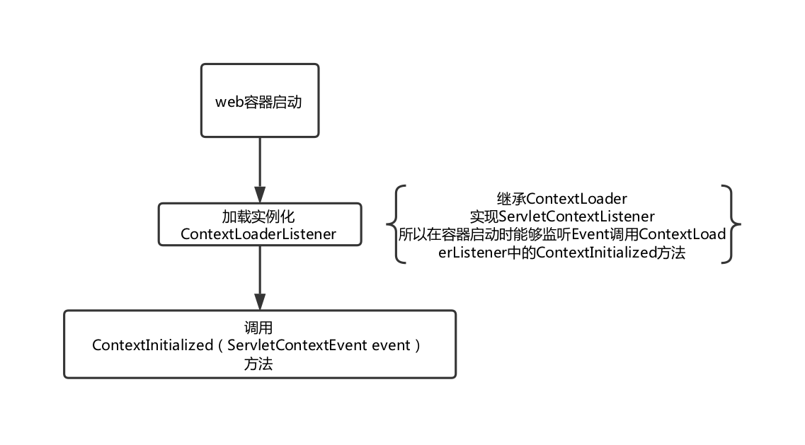
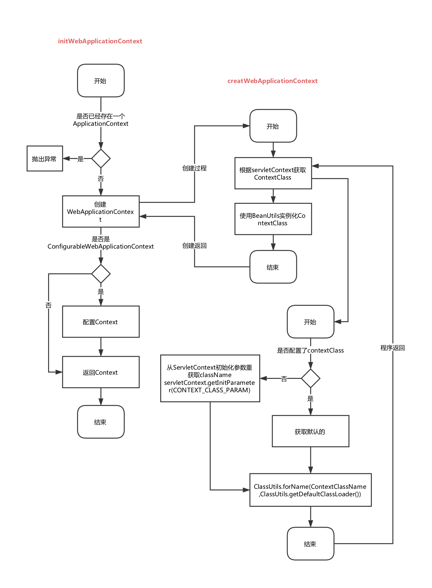

## Spring容器的启动过程是什么？
Spring在web容器中，启动过程是Servlet容器对Spring环境的构造，初始化，装配的过程。

## Spring的启动过程

1. **通过ContextLoaderListener监听作为启动Spring的入口**

   启动必要条件：在web.xml中配置

   ```xml
   <listener>
       <listener-class>org.springframework.web.context.ContextLoaderListener</listener-class>
   </listener>
   ```

   ContextLoaderListener(Spring中的类)继承ContextLoader（Spring中的类），并实现ServletContextListener（Servlet中的接口），ServletContextListener监听ServletContext，当容器启动时，会触发ServletContextEvent事件，该事件由ServletContextListener来处理，启动初始化ServletContext时，调用contextInitiallized方法。而ContextLoaderListener实现了ServletContextListener，所以，当容器启动时，触发ServletContextEvent事件，让ContextLoaderListener执行实现方法contextInitialized（ServletContextEvent sce）

   ```java
   public class ContextLoaderListener extends ContextLoader implements ServletContextListener {
         public void contextInitialized(ServletContextEvent event) {
           this.contextLoader = createContextLoader();
           if (this.contextLoader == null) {
               this.contextLoader = this;
           }
           this.contextLoader.initWebApplicationContext(event.getServletContext());
       }
   }
   ```
   

   2. **通过initWebApplicationContext方法来初始化WebApplicaitionContext**

      webApplicationContext是Spring中的上下文。它的作用等同于Servlet中的ServletContext。

      ```java
      public WebApplicationContext initWebApplicationContext(ServletContext servletContext) {
              if (servletContext.getAttribute(WebApplicationContext.ROOT_WEB_APPLICATION_CONTEXT_ATTRIBUTE) != null) {
                  throw new IllegalStateException(
                          "Cannot initialize context because there is already a root application context present - " +
                          "check whether you have multiple ContextLoader* definitions in your web.xml!");
              }
              try {
                  if (this.context == null) {
                      this.context = createWebApplicationContext(servletContext);
                  }
                  if (this.context instanceof ConfigurableWebApplicationContext) {
                      ConfigurableWebApplicationContext cwac = (ConfigurableWebApplicationContext) this.context;
                      if (!cwac.isActive()) {
                          if (cwac.getParent() == null) {
                              ApplicationContext parent = loadParentContext(servletContext);
                              cwac.setParent(parent);
                          }
                          configureAndRefreshWebApplicationContext(cwac, servletContext);
                      }
                  }
                  servletContext.setAttribute(WebApplicationContext.ROOT_WEB_APPLICATION_CONTEXT_ATTRIBUTE, this.context);

                  ClassLoader ccl = Thread.currentThread().getContextClassLoader();
                  if (ccl == ContextLoader.class.getClassLoader()) {
                      currentContext = this.context;
                  }
                  else if (ccl != null) {
                      currentContextPerThread.put(ccl, this.context);
                  }

                  if (logger.isDebugEnabled()) {
                      logger.debug("Published root WebApplicationContext as ServletContext attribute with name [" +
                              WebApplicationContext.ROOT_WEB_APPLICATION_CONTEXT_ATTRIBUTE + "]");
                  }
                  if (logger.isInfoEnabled()) {
                      long elapsedTime = System.currentTimeMillis() - startTime;
                      logger.info("Root WebApplicationContext: initialization completed in " + elapsedTime + " ms");
                  }

                  return this.context;
              }
              catch (RuntimeException ex) {
                  logger.error("Context initialization failed", ex);
                  servletContext.setAttribute(WebApplicationContext.ROOT_WEB_APPLICATION_CONTEXT_ATTRIBUTE, ex);
                  throw ex;
              }
              catch (Error err) {
                  logger.error("Context initialization failed", err);
                  servletContext.setAttribute(WebApplicationContext.ROOT_WEB_APPLICATION_CONTEXT_ATTRIBUTE, err);
                  throw err;
              }
          }
      ```

      initWebApplicationContext(ServletContext servletContext)方法是ContextLoader中的方法。他的作用是只做一个WebApplicationContext上下文，并将这个上下文保存在servletContext中，并保存在当前ContextLoader实例中。

   3. **如何初始化WebApplicationContext**

      上面的源码中的`this.context = createWebApplicationContext(servletContext);`用来制造一个WebApplicationContext，制造的过程，依赖ServletContext。

      ```java
      protected WebApplicationContext createWebApplicationContext(ServletContext sc) {
              Class<?> contextClass = determineContextClass(sc);
              if (!ConfigurableWebApplicationContext.class.isAssignableFrom(contextClass)) {
                  throw new ApplicationContextException("Custom context class [" + contextClass.getName() +
                          "] is not of type [" + ConfigurableWebApplicationContext.class.getName() + "]");
              }
              return (ConfigurableWebApplicationContext) BeanUtils.instantiateClass(contextClass);
          }
      ```

      通过`determineContextClass(ServletContext servletContext)`方法获取需要实例化的context类的class，通过`BeanUtils.instantiateClass(contextClasss)`将这个class用反射的手段实例化WebApplicationContext。

      那么determineContextClass怎样来确定实例化哪个context类呢？（Spring有很多的context类实现了WebApplicationContext，当然这个context类也可以是我们自己写的，具体实例化哪个，在`web.xml`中配置）

      ```java
      protected Class<?> determineContextClass(ServletContext servletContext) {
              String contextClassName = servletContext.getInitParameter(CONTEXT_CLASS_PARAM);
              if (contextClassName != null) {
                  try {
                      return ClassUtils.forName(contextClassName, ClassUtils.getDefaultClassLoader());
                  }
                  catch (ClassNotFoundException ex) {
                      throw new ApplicationContextException(
                              "Failed to load custom context class [" + contextClassName + "]", ex);
                  }
              }
              else {
                  contextClassName = defaultStrategies.getProperty(WebApplicationContext.class.getName());
                  try {
                      return ClassUtils.forName(contextClassName, ContextLoader.class.getClassLoader());
                  }
                  catch (ClassNotFoundException ex) {
                      throw new ApplicationContextException(
                              "Failed to load default context class [" + contextClassName + "]", ex);
                  }
              }
          }
      ```

      从上面的代码可以看出，先从servletContext中找我们在`web.xml`中有没有配置要实例化哪个上下文context，如果配置了

      ```xml
      <context-param>   
        <param-name>contextClass</param-name>   
        <param-value>rg.springframework.web.context.support.StaticWebApplicationContext</param-value>   
      </context-param>
      ```

      那么实例化StaticWebApplicationContext这个上下文。注意这个地方的`param-name`必须是`contextClass`（约定俗成的，其实是写死的）。如果没有这个配置，那么程序会找到一个叫`ContextLoader.properties`的配置文件，这个配置文件注明了一个默认的上下文：`XMLWebApplicationContext`。这个`XMLWebApplicationContext`实例化的过程是制造一个ResourcePatternResolver的实例，这个实例将会在后面的Srping启动过程中起到关键作用。

