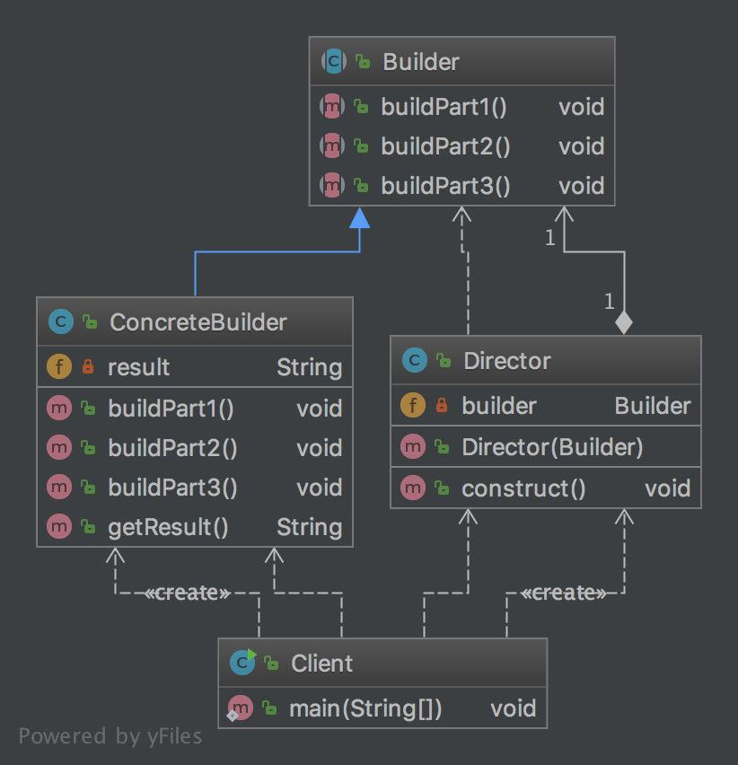
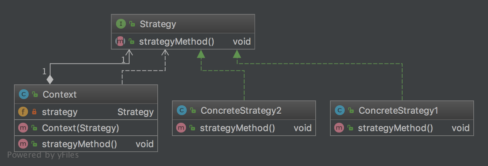
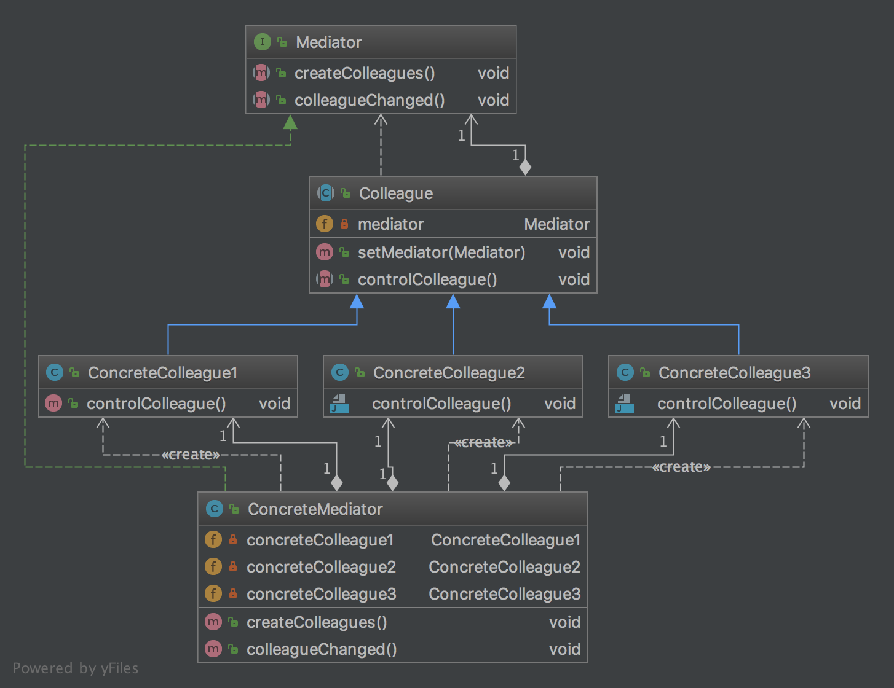

由浅入深的介绍一下Gof的23种设计模式

## Iterator模式
**Iterator模式（迭代器模式）：**

**「Iterator模式」**中登场的角色：

- **Iterator（迭代器）：**该角色负责定义按顺序逐个遍历元素的接口（API）。
- **ConcreteIterator（具体的迭代器）**：该角色负责实现Iterator角色所定义的接口（API）。
- **Aggregate（集合）：**该角色负责定义创建Iterator角色的接口（API）。
- **ConcreteAggregate（具体的集合）：**该角色负责实现Aggregate角色所定义的接口（API）。

## Adapter模式

**Adapter模式（适配器模式）：**

- 类适配器模式（使用继承的适配器）

- 对象适配器模式（使用委托的适配器）

**「Adapter模式」**中登场的角色：

- **Target（对象）：**该角色负责定义所需的方法。
- **Client（请求者）：**该角色负责使用Target角色所定义的方法进行具体处理。
- **Adaptee（被适配）：**注意不是Adapt-er（适配）角色，而是Adapt-ee（被适配）角色。Adaptee是一个持有既定方法的角色。
- **Adapter（适配）：**Adapter模式的主人公。使用Adaptee角色的方法来满足Target角色的需求，这是Adapter模式的目的，也是Adapter的作用。

## Template Method模式

**Template Method模式（模版方法模式）：**

**「Template Method模式」**中登场的角色：

- **AbstractClass（抽象类）：**AbstractClass角色不仅负责实现模版方法，还负责声明在模版方法中所使用到的抽象方法。这些抽象方法由子类ConcreteClass角色负责实现。
- **ConcreteClass（具体类）：**该角色负责具体实现AbstractClass角色中定义的抽象方法。这里实现的方法将会在AbstractClass角色的模版方法中被调用。

## Factory Method模式

**Factory Method模式（工厂方法模式）：**

**「Factory Method模式」**中登场的角色：

- **Product（产品）：**Product角色属于框架这一方，是一个抽象类。它定义了在Factory Method模式中生成的那些实例所持有的接口（API），但具体的处理则由子类ConcreteProduct角色决定。

- **Creator（创建者）：**Creator角色属于框架这一方，它是负责生成Product角色的抽象类，但具体的处理则由子类ConcreteCreator角色决定。

  不用`new`关键字来生成实例，而是调用生成实例的专用方法来生成实例，这样就可以防止父类与其他具体类的耦合。

- **ConcreteProduct（具体的产品）：**ConcreteProduct角色属于具体加工这一方，它决定了具体的产品。

- **ConcreteCreator（具体的创建者）：**ConcreteCreator角色属于具体加工这一方，它负责生成具体的产品。

## Singleton模式

**Singleton模式（单例模式）：**

**「Singleton模式」**中登场的角色：

- **Singleton（单例）：**在Singleton模式中，只有Singleton这一个角色。Singleton角色中有一个返回唯一实例的static方法。该方法总是会返回同一个实例。

## Prototype模式

**Prototype模式（原型模式）：**

**「Prototype模式」**中登场的角色：

- **Prototype（原型）：**Prototype角色负责定义用于复制现有实例来生成新实例的方法。
- **ConcretePrototype（具体的原型）：**角色负责实现复制现有实例并生成新实例的方法。
- **Client（使用者）：**Client角色负责使用复制实例的方法生成新的实例。

## Builder模式

**Builder模式（建造者模式）：**

**「Builder模式」**中登场的角色：

- **Builder（建造者）：**Builder角色负责定义用于生成实例的接口（API）。Builder角色中准备了用于生成实例的方法。
- **ConcreteBuilder（具体的建造者）：**ConcreteBuilder角色是负责实现Builder角色的接口的类（API）。这里定义了在生成实例时实际被调用的方法。
- **Director（监工）：**Director角色负责使用Builder角色的接口（API）来生成实例。它并不依赖于ConcreteBuilder角色。为了确保不论ConcreteBuilder角色是如何被定义的，Director角色都能正常工作，它只调用在Builder角色中被定义的方法。
- **Client（使用者）：**该角色使用了Builder模式。（模式中不包含此角色）

## Abstract Factory模式

**Abstract Factory模式（抽象工厂模式）：**

**「Abstract Factor模式」**中登场的角色：

- **AbstractProduct（抽象产品）：**AbstractProduct角色负责定义AbstractFactory角色所生成的抽象零件和产品的接口（API）。
- **AbstractFactory（抽象工厂）：**AbstractFactory角色负责定义用于生成抽象产品的接口（API）。
- **Client（委托者）：**Client角色仅会调用AbstractFactory角色和AbstractProduct角色的接口（API）来进行工作，对于具体零件、产品和工厂一无所知。
- **ConcreteProduct（具体产品）：**ConcreteProduct角色负责实现AbstractProduct角色的接口（API）。
- **ConcreteFactory（具体工厂）：**ConcreteFactory角色负责实现AbstractFactory角色的接口（API）。

## Bridge模式

**Bridge模式（桥接模式）：**

**「Bridge模式」**中登场的角色：

- **Abstraction（抽象化）：**该角色位于“类的功能层次结构“的最上层。它使用Implementor角色的方法定义了基本的功能。该角色中保存了Implementor角色的实例。
- **RefinedAbstraction（改善后的抽象化）：**在Abstraction角色的基础上增加了新功能的角色。
- **Implementor（实现者）：**该角色位于”类的实现层次结构“的最上层。它定义了用于实现Abstraction角色的接口（API）的方法。
- **ConcreteImplementor（具体实现者）：**该角色负责实现在Implementor角色中定义的接口（API）。

## Strategy模式

**Strategy模式（策略模式）：**

**「Strategy模式」**中登场的角色：

- **Strategy（策略）：**Strategy角色负责实现策略所必需的接口（API）。
- **ConcreteStrategy（具体的策略）：**ConcreteStrategy角色负责实现Strategy角色的接口（API）。
- **Context（上下文）：**负责使用Strategy角色。Context角色保存了ConcreteStrategy角色的实例，并使用ConcreteStrategy角色去实现需求（总之，还是要调用Strategy角色的接口（API）。

## Composite模式

**Composite模式（组合模式）：**

**「Composite模式」**中登场的角色：

- **Leaf（树叶）：**表示“内容”的角色。在该角色中不能放入其他对象。
- **Composite（复合物）：**表示容器的角色。可以在其中放入Leaf角色和Composite角色。
- **Component（组件）：**是Leaf角色和Composite角色具有一致性的角色。Component角色是Leaf角色和Composite角色的父类。
- **Client（使用者）：**使用Composite模式的角色。

## Decorator模式

**Decorator模式（装饰器模式）：**

**「Decorator模式」**中登场的角色：

- **Component（组件）：**增加功能的核心角色。
- **ConcreteComponent（具体组件）：**该角色是实现了Component角色所定义的接口（API）的具体实现。
- **Decorator（装饰物）：**该角色具有与Component角色相同的接口（API）。在它内部保存了被装饰对象——Component橘色。Decorator角色知道自己要装饰的对象。
- **ConcreteDecorator（具体的装饰物）：**该角色是具体Decorator角色。

## Visitor模式

**Visitor模式（访问者模式）：**

**「Visitor模式」**中登场的角色：

- **Visitor（访问者）：**Visitor角色负责对数据结构中每个具体的元素（ConcreteElement角色）声明一个用于访问XXXX的visit（XXXX）方法。visit（XXXX）适用于处理XXXX的方法。负责实现该方法的是ConcreteVisitor角色。
- **ConcreteVisitor（具体的访问者）：**ConcreteVisitor角色负责实现Visitor角色所定义的接口（API）。它要实现所有的visit（XXXX）方法，即实现如何处理每个ConcreteElement角色。
- **Element（元素）：**Element角色表示Visitor角色的访问对象。它声明了接受访问者的accept方法。accept方法解搜到的参数是Visitor角色。
- **ConcreteElement（具体的元素）：**ConcreteElement角色负责实现Element角色所定义的接口（API）。
- **ObjectStructure（对象结构）：**ObjectStructure角色负责处理Element角色的集合。ConcreteVisitor橘色为每个Element角色都准备了处理方法。

## Chain of Responsibility模式

**Chain of Responsibility模式（责任链模式）：**

**「Chain of Responsibility模式」**中登场的角色：

- **Handler（处理者）：**Handler角色定义了处理请求的接口（API）。Handler角色知道“下一个处理者”是谁。如果自己无法处理，它会将请求转给“下一个处理者”。当然，“下一个处理者”也是Handler角色。
- **ConcreteHandler（具体的处理者）：**ConcreteHandler角色是处理请求的具体角色。
- **Client（请求者）：**Client角色是向第一个ConcreteHandler角色发送请求的角色。

## Facade模式

**Facade模式（窗口模式）：**

**「Facade模式」**中登场的角色：

- **Facade（窗口）：**Facade角色是代表构成系统的许多其他角色的“简单窗口”。Facade角色向系统外部提供高层（API）。
- **构成系统的其他角色：**这些角色各自完成自己的工作，他们并不知道Facade角色。Facade角色调用其他角色进行工作，但是其他角色不会调用Facade角色。
- **Client（请求者）：**Client角色负责调用Facade角色（Client角色并不包含在Facade模式中）。

## Mediator模式

**Mediator模式（仲裁者模式）：**

**「Mediator模式」**中登场的角色：

- **Mediator（仲裁者、中介者）：**Mediator角色负责定义与Colleague角色进行通信和做出决定的接口（API）。
- **ConcreteMediator（具体的仲裁者、中介者）：**ConcreteMediator角色负责实现Mediator角色的接口（API），负责实际做出决定。
- **Colleague（同事）：**Colleague角色负责定义与Mediator角色进行通信的接口（API）。
- **ConcreteColleague（具体的同事）：**ConcreteColleague角色负责实现Colleague角色的接口（API）。

## Observer模式

**Observer模式（观察者模式）：**

**「Observer模式」**中登场的角色：

- **Subject（观察对象）：**Subject角色表示观察对象。Subject角色定义了注册观察者和删除观察者的方法。此外，它还声明了“获取现在的状态”的方法。
- **ConcreteSubject（具体的观察对象）：**ConcreteSubject角色表示具体的被观察对象。当自身状态发生变化后，它会通知所有已经注册的Observer角色。
- **Observer（观察者）：**Observer角色负责接收来自Subject角色的状态变化的通知。为此，他声明了update方法。
- **ConcreteObserver（具体的观察者）：**ConcreteObserver角色表示具体的Observer。当它的update方法被调用后，会去获取需要观察的对象的最新状态。

## Memento模式

**Memento模式（备忘录）模式：**

**「Memento模式」**中登场的角色：

- **Originator（生成者）：**Originator角色会在保存自己的最新状态时生成Memento角色。当把以前保存的Memento橘色传递给Originator角色时，它会将自己恢复至生成该Memento角色时的状态。

- **Memento（备忘录）：**Memento角色会将Originator角色的内部信息整合在一起。在Memento角色中虽然保存了Originator角色的信息，但它不会向外部公开这些信息。

  Memento角色有以下两种接口（API）

  - wide interface——宽接口（API）：Memento角色提供的“宽接口（API）”是指所有用于获取恢复对象状态的方法的集合。由于宽接口（API）会暴露所有Memento角色的内部信息，因此能够使用宽接口（API）的只有Originator角色。
  - narrow interface——窄接口（API）：Memento角色为外部的Caretaker角色提供了“窄接口（API）”。可以通过窄接口（API）获取的Memento角色的内部信息非常有限，因此可以有效地防止信息泄漏。

  通过对外提供以上两种接口（API），可以有效地防止对象的封装性被破坏。

- **Caretaker（负责人）：**当Caretaker角色想要保存当前的Originator角色的状态时，会通知Originator角色。Originator角色在接收到通知后会生成Memento角色的实例并将其返回给Caretaker角色。由于以后可能会用Memento实例来将Originator恢复至原来的状态，因此Caretaker角色会一直保存Memento实例。

  不过Caretaker角色只能使用Memento角色两种接口（API）中的窄接口（API），也就是说它无法访问Memento角色内部的所有信息。它只是将Originator角色生成的Memento角色当作一个黑盒子保存起来。

  虽然Originator角色和Memento角色之间时强关联关系，但Caretaker角色和Memento角色之间时弱关联关系。Memento角色对Caretaker角色隐藏了自身的内部信息。

## State模式

**State模式（状态模式）：**

**「State模式」**中登场的角色：

- **State（状态）：**State角色表示状态，定义了根据不同状态进行不同处理的接口（API）。该接口（API）是哪些处理内容依赖于状态的方法集合。
- **ConcreteState（具体状态）：**ConcreteState角色表示各个具体的状态，它实现了State接口。
- **Context（状况、前后关系、上下文）：**Context角色持有表示当前状态的ConcreteState角色。此外，他还定义了供外部调用者使用State模式的接口（API）。

## Flyweight模式

**Flyweight模式（享元模式）：**

**「Flyweight模式」**中登场的角色：

- **Flyweight（轻量级）：**按照通常方式编写程序会导致程序变重，所以如果能够共享实例会比较好，而Flyweight角色表示的就是那些实例会被共享的类。
- **FlyweightFactory（轻量级工厂）：**FlyweightFactory角色时生成Flyweight角色的工厂。在工厂中生成Flyweight角色可以实现共享实例。
- **Client（请求者）：**Client角色使用FlyweightFactory角色来生成Flyweight角色。（与Gof的定义有差异）

## Proxy模式

**Proxy模式（代理模式）：**

**「Proxy模式」**中登场的角色：

- **Subject（主体）：**Subject角色定义了使Proxy角色和RealSubject角色之间具有一致性的接口。由于存在Subject角色，所以Client角色不必在意它所使用的究竟是Proxy角色还是RealSubject角色。
- **Proxy（代理人）：**Proxy角色会尽量处理来自Client角色的请求。只有当自己不能处理时，它才会将工作交给RealSubject角色。Proxy角色只有在必要时才会生成RealSubject角色。Proxy角色实现了在Subject角色中定义的接口（API）。
- **RealSubject（实际的主体）：**“本人”RealSubject角色会在“代理人”角色无法胜任工作时出场。它与Proxy角色一样，也实现了在Subject角色中定义的接口（API）。
- **Client（请求者）：**使用Proxy模式的角色。

## Command模式

**Command模式（命令模式）：**

**「Command模式」中登场的角色：**

- **Command（命令）：**Command角色负责定义命令的接口（API）。
- **ConcreteCommand（具体的命令）：**ConcreteCommand角色负责实现在Command角色中定义的接口（API）。
- **Receiver（接收者）：**Receiver角色是Command角色执行命令时的对象，也可以称其为命令接收者。
- **Client（请求者）：**Client角色负责生成ConcreteCommand角色并分配Receiver角色。
- **Invoker（发动者）：**Invoker角色时开始执行命令的角色，它会调用在Command角色中定义的接口（API）。

## Interpreter模式

**Interpreter模式（解释器模式）：**

**「interpreter模式」**中登场的角色：

- **AbstractExpression（抽象表达式）：**AbstractExpression角色定义了语法树节点的共同接口（API）。
- **TerminalExpression（终结符表达式）：**TerminalExpression角色对应BNF中的终结符表达式。
- **NonTerminalExpression（非终结符表达式）：**NonTerminalExpression角色对应BNF中的非终结符表达式。
- **Context（文脉，上下文）：**Context角色为解释器进行语法解析提供了必要的信息。
- **Client（请求者）：**为了推导语法树，Client角色会调用TerminalExpression角色和NonterminalExpression角色。

